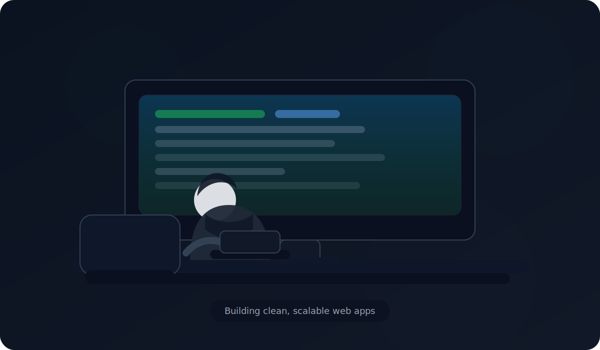

# Hi, I'm Saumya Bhardwaj 👋

Full-stack developer (MERN) • B.Tech CSE (AI & ML) • New Delhi, India

## Let's Connect

## Profile Overview

- Currently focused on: MERN full-stack development, REST APIs, authentication, performance, and practical AI-assisted features
- Learning: advanced DSA, system design fundamentals, and cloud deployment workflows
- Open to: internships and entry-level roles in Full Stack / Backend / AI-assisted product development

## Tech Stack & Tools

**Frontend**

**Backend**

**Database / Cloud**

**Tools**

## Featured Projects

- **Blog Web Application** — MERN blogging platform with authentication, posts, likes, comments, and a smoother authoring experience. [Demo](https://meloque.me/)
- **E-commerce Website (Pocket Cart)** — React-based e-commerce UI with product listings, filtering, cart, and order workflow. [Demo](https://e-commerce-project-nu-indol.vercel.app/)

## Experience

- **PHP Developer Intern** — built and maintained responsive web applications, implemented server-side logic, and improved performance and UX.

## GitHub Stats

